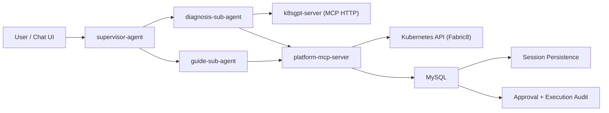

# PaaS Agent Assistant

<p align="center">
  <strong>A multi-agent PaaS operations assistant built with AgentScope Java</strong>
</p>

<p align="center">
  <a href="#overview">Overview</a> •
  <a href="#functional-architecture">Functional Architecture</a> •
  <a href="#system-architecture">System Architecture</a> •
  <a href="#tool-catalog">Tool Catalog</a> •
  <a href="#tech-stack">Tech Stack</a> •
  <a href="#quick-start">Quick Start</a>
</p>

## Overview

PaaS Agent Assistant refactors the original demo into a platform-oriented assistant for Kubernetes diagnosis and guided operations.

The current V1 keeps the existing `Supervisor -> Sub Agent -> MCP -> Storage` skeleton and focuses on one primary workflow:

1. Read cluster and workload state
2. Diagnose issues
3. Generate an execution plan for risky actions
4. Execute only after explicit confirmation
5. Persist approvals and execution audit records in MySQL

The public chat entry is a structured Server-Sent Events stream:

`POST /api/assistant/chat/structured` with JSON body `{chat_id, user_id, user_query}`

## Functional Architecture

### Supervisor Agent

`supervisor-agent` remains the single chat entry and routing layer.

- Keeps SSE output and MySQL-backed session loading
- Routes diagnosis, repair, restart, scale, patch, and recovery requests to `diagnosis-sub-agent`
- Routes YAML explanation, `describe` interpretation, command recommendation, and resource guidance requests to `guide-sub-agent`

### Diagnosis Sub Agent

`diagnosis-sub-agent` is responsible for Kubernetes diagnosis and controlled changes.

- Uses read-only MCP tools first to inspect state, events, logs, and diagnosis results
- Summarizes symptoms, likely causes, risks, and recommended actions
- Uses a mandatory two-step protocol for changes:
  - `change-plan-*`
  - `change-execute(approval_id, confirmed=true)`

Supported V1 resources:

`Pod`, `Deployment`, `StatefulSet`, `DaemonSet`, `Job`, `Service`, `Ingress`, `Node`, `Event`, `PVC`, `Namespace`

Supported V1 change actions:

- Restart workload
- Scale workload
- Delete pod
- Patch whitelisted fields

### Guide Sub Agent

`guide-sub-agent` is the read-only consulting assistant.

- Answers resource guide questions with RAG content
- Explains YAML fields and `kubectl describe` output
- Recommends safe troubleshooting commands
- Reuses `platform-mcp-server` change-status tools for checking execution results
- Never executes changes

### Platform MCP Server

`platform-mcp-server` is the mutation execution facade.

- Uses Fabric8 Kubernetes Client for controlled execution
- Creates and tracks approvals plus execution audit records in MySQL
- Diagnosis tools are served by `k8sgpt-server` directly to the agents

### Data Layer

The legacy demo business tables are removed from the active application flow.

Kept:

- MySQL session persistence for chat state
- `operation_approval`
- `operation_execution`

Removed:

- `users`
- `products`
- `orders`
- `feedback`

## System Architecture



## Tool Catalog

### Read and Diagnosis Tools (via k8sgpt MCP Server)

- `analyze`
- `cluster-info`
- `list-resources`
- `get-resource`
- `list-namespaces`
- `list-events`
- `get-logs`
- `config`
- `list-filters` / `add-filters` / `remove-filters`
- `list-integrations`

### Controlled Change Tools

- `change-plan-restart`
- `change-plan-scale`
- `change-plan-delete-pod`
- `change-plan-patch`
- `change-execute`
- `change-get-status`

### Execution Contract

All mutation requests must follow the same contract:

1. Create a plan with one of the `change-plan-*` tools
2. Show the user `approval_id`, target, impact, and rollback hint
3. Wait for explicit confirmation
4. Call `change-execute` with `approval_id`

Every execution result returns these standard fields:

- `approval_id`
- `execution_id`
- `resource_ref`
- `action`
- `status`
- `summary`
- `rollback_hint`

## Tech Stack

| Layer | Technology |
|---|---|
| Agent framework | AgentScope Java |
| Backend runtime | Spring Boot |
| Tool protocol | MCP Spring WebFlux |
| Agent coordination | A2A over Nacos |
| Diagnosis upstream | k8sgpt MCP HTTP (direct) |
| Change execution | Fabric8 Kubernetes Client |
| Persistence | MySQL |
| Frontend | Vue 3, TypeScript, Pinia, Vue Router |
| AI providers | DashScope, OpenAI-compatible APIs |
| Knowledge retrieval | Dify RAG |
| Memory | AutoContextMemory, Mem0 |
| Deployment | Docker Compose, Helm |

## Repository Layout

```text
.
├── platform-mcp-server
├── diagnosis-sub-agent
├── guide-sub-agent
├── supervisor-agent
├── frontend
├── helm
├── mysql-image
└── nacos-image
```

## Quick Start

### 1. Prepare configuration

Key runtime settings:

- Model: `MODEL_PROVIDER`, `MODEL_API_KEY`, `MODEL_NAME`, `MODEL_BASE_URL`
- Nacos: `NACOS_SERVER_ADDR`, `NACOS_NAMESPACE`, `NACOS_USERNAME`, `NACOS_PASSWORD`
- MySQL: `DB_HOST`, `DB_PORT`, `DB_NAME`, `DB_USERNAME`, `DB_PASSWORD`
- k8sgpt: `K8SGPT_MCP_URL`
- Kubernetes access:
  - `K8S_AUTH_MODE=incluster|kubeconfig`
  - `KUBECONFIG_PATH`
  - `K8S_CONTEXT`
- Approval TTL: `EXECUTION_APPROVAL_TTL_SECONDS`

### 2. Start with Docker Compose

```bash
docker compose up -d
```

This deployment includes:

- `mysql`
- `nacos-server`
- `k8sgpt-server`
- `platform-mcp-server`
- `guide-sub-agent`
- `diagnosis-sub-agent`
- `supervisor-agent`

### 3. Open the application

By default the chat UI is served by `supervisor-agent`:

- UI: `http://localhost:10008`
- Chat SSE: `POST http://localhost:10008/api/assistant/chat/structured`

Example:

```bash
curl -N -X POST http://localhost:10008/api/assistant/chat/structured \
     -H 'Content-Type: application/json' \
     -H 'Accept: text/event-stream' \
     -d '{"chat_id":"demo-chat","user_id":"ops-user","user_query":"Pod foo CrashLoopBackOff, help me diagnose"}'
```

## V1 Scope

Included in this refactor:

- Single-cluster Kubernetes diagnosis
- Explicitly confirmed execution flow
- Approval and execution audit persistence
- Guide assistant for YAML, describe, and command help
- Compose and Helm wiring for `k8sgpt-server`

Not included in V1:

- Multi-cluster routing
- Tenant isolation
- Platform CRD diagnosis
- Automatic execution without explicit confirmation
