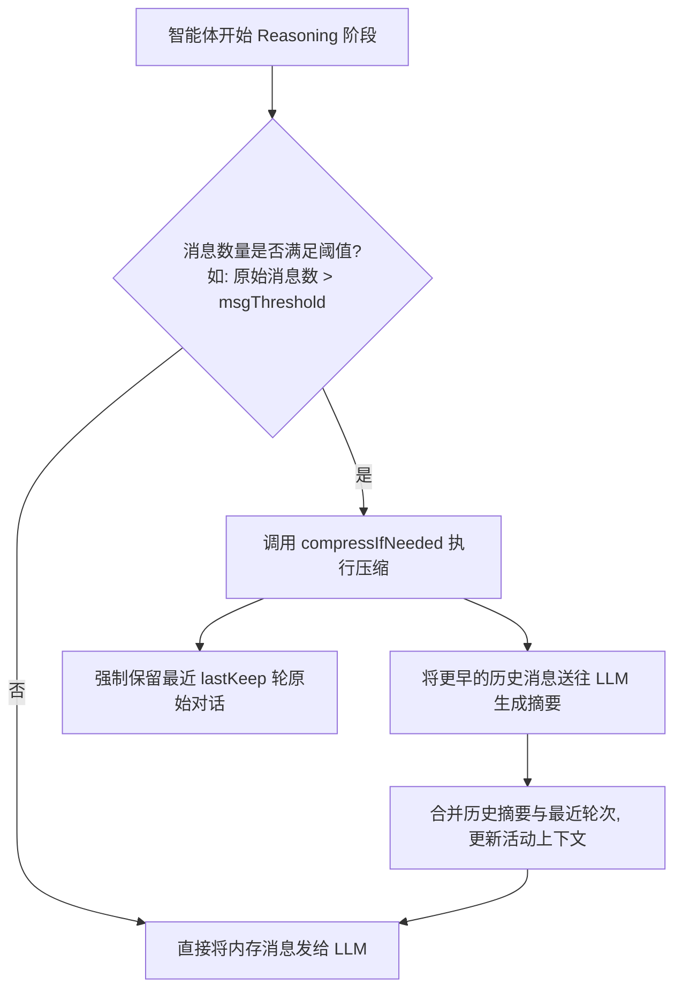
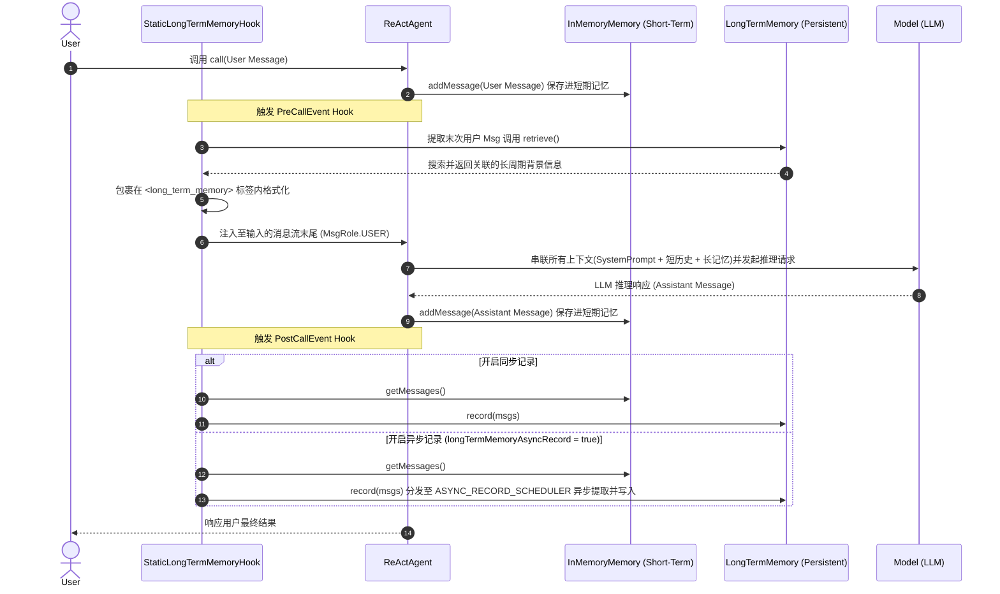

# AgentScope Java 记忆与状态管理架构分析报告

本报告结合了 AgentScope Java 项目源码与 `5.x` 系列官方设计文档（包含短期记忆、长期记忆扩展及状态持久化），系统梳理了 AgentScope Java 中的 **记忆体系结构**、**上下文自动管理**、**长记忆插件集成**、**状态持久化/会话管理机制**、**核心控制流程** 与 **设计要点**。

---

## 一、 整体架构概述

AgentScope Java 的记忆与状态管理系统采用高度解耦的多层分工设计，包含：
1. **短期/会话记忆（Short-term Memory）**：负责当前会话中，智能体与用户之间的对话上下文交互历史。包含基础的不限流内存存储以及智能自适应上下文压缩扩展。
2. **长期记忆（Long-term Memory）**：负责跨越单个会话，持久保存并提取用户偏好、习惯或任务关键事实。
3. **状态持久化（State Persistence）**：基于 `StateModule` 体系与 `Session` 存储机制，将各组件内存状态持久化至外部媒介（如 JSON 文件）。

```mermaid
graph TD
    subgraph 状态管理层 (State Management)
        StateModule[StateModule Interface] --> Memory[Memory Interface]
        StateModule --> PlanNotebook[PlanNotebook]
        StateModule --> ReActAgent[ReActAgent]
    end

    subgraph 短期记忆体系 (Short-term Memory)
        Memory --> InMemoryMemory[InMemoryMemory]
        Memory --> AutoContextMemory[AutoContextMemory]
    end

    subgraph 长期记忆体系 (Long-term Memory)
        LongTermMemory[LongTermMemory Interface] --> Mem0LongTermMemory[Mem0LongTermMemory]
        LongTermMemory --> ReMeLongTermMemory[ReMeLongTermMemory]
    end

    subgraph 存储与会话 (Storage & Session)
        Session[Session Interface] --> JsonSession[JsonSession]
        Session --> InMemorySession[InMemorySession]
        SessionManager[SessionManager API] -->|管理组件| StateModule
        SessionManager -->|调用存储| Session
    end
```

---

## 二、 短期记忆系统 (Short-term Memory)

短期记忆用于保存当前轮次的上下文，核心接口为 [Memory.java](file:///Users/xuuyin/AI/agentscope-java-1.0.12/agentscope-core/src/main/java/io/agentscope/core/memory/Memory.java)，项目提供了两种核心实现。

### 1. 基础短期记忆 ([InMemoryMemory.java](file:///Users/xuuyin/AI/agentscope-java-1.0.12/agentscope-core/src/main/java/io/agentscope/core/memory/InMemoryMemory.java))
* **特点**：易用、无上下文压缩管理。消息数量随对话轮数增加无限累积，适合短轮次、结构简单的对话。
* **并发控制**：内部消息存储采用线程安全的 `CopyOnWriteArrayList<Msg>`，规避并发读写冲突。
* **数据流向**：
  ```java
  Memory memory = new InMemoryMemory();
  ReActAgent agent = ReActAgent.builder()
      .name("Assistant")
      .model(model)
      .memory(memory)
      .build();
  ```

### 2. 自动上下文管理记忆 (`AutoContextMemory`)
当会话极长或模型上下文窗口（Context Window）受限时，无限追加消息会引发**上下文溢出（Context Overflow）**。AgentScope Java 在扩展包中提供了自适应上下文记忆管理方案。

#### 核心组件
* **`AutoContextConfig`**：控制压缩及清理阈值：
  * `msgThreshold`：触发上下文压缩的消息数临界点。
  * `lastKeep`：执行压缩时，强制保留的最近原始消息轮数。
  * `tokenRatio`：压缩时目标占用的最大 Token 窗口比例。
* **`ContextOffloadTool`**：注册于 Agent 的 Toolkit，大模型可通过此工具检索已被卸载（Offload）到冷存储的更早期历史记录。
* **`AutoContextHook`**：实现 Agent 生命周期生命周期钩子：
  * **在 `PreCallEvent` 时**：将 `ContextOffloadTool` 自动载入 Agent 工具箱，并将 `PlanNotebook` 与记忆绑定。
  * **在 `PreReasoningEvent` 时**：判定消息是否超出 `msgThreshold` 阈值，若超出则自动触发 `compressIfNeeded()`。由 LLM 自动将更早的历史对话总结归纳为摘要（Summary），同时清空被压缩的原始消息列表，只保留最近 `lastKeep` 轮的原始对话，从而维持高信息密度的紧凑上下文。

#### 上下文自动压缩工作流


---

## 三、 长期记忆系统 (Long-term Memory)

长期记忆通过抽象的 [LongTermMemory.java](file:///Users/xuuyin/AI/agentscope-java-1.0.12/agentscope-core/src/main/java/io/agentscope/core/memory/LongTermMemory.java) 接口，将大模型的非易失性记忆提取和基于向量/键值的关联搜索引入框架中。

### 1. 长期记忆的工作模式 ([LongTermMemoryMode.java](file:///Users/xuuyin/AI/agentscope-java-1.0.12/agentscope-core/src/main/java/io/agentscope/core/memory/LongTermMemoryMode.java))

| 模式名称 | 核心行为机制 | 适用场景 |
| :--- | :--- | :--- |
| `STATIC_CONTROL` | 框架根据用户最新 Input 自动做检索（基于 `StaticLongTermMemoryHook` 的 `PreCallEvent` 检索并包装在标签内注入上下文），在回复后自动通过 `PostCallEvent` 调用 `record` 保存（非阻塞）。 | 简化开发，大模型静默感知上下文。偏好在底层自动化运行。 |
| `AGENT_CONTROL` | 不通过 Hook 注入。框架自动在 Toolkit 注册由 [LongTermMemoryTools.java](file:///Users/xuuyin/AI/agentscope-java-1.0.12/agentscope-core/src/main/java/io/agentscope/core/memory/LongTermMemoryTools.java) 适配的 `@Tool` 方法：`recordToMemory` 和 `retrieveFromMemory`。 | 智能体高度自主，自我判断何时记录备忘、何时检索关联偏好。 |
| `BOTH` | 兼具 Hook 的背景自动保存/载入，与大模型对 `@Tool` 工具的主动显式调用。 | 混合形态，既能兜底全部历史上下文，又支持 Agent 进行精准事实写入。 |

### 2. 长期记忆第三方扩展插件
AgentScope Java 默认支持两种优秀的 LTM 底层引擎适配：

#### A. Mem0 集成 (`Mem0LongTermMemory`)
Mem0 是先进的智能体个性化记忆层，能够自适应提取、合并和清除记忆实体。框架支持两种连接模式：
* **Mem0 云平台服务 (Platform Mode)**：
  ```java
  Mem0LongTermMemory cloudMemory = Mem0LongTermMemory.builder()
          .agentName("Assistant")
          .userId("user_123")
          .apiBaseUrl("https://api.mem0.ai")
          .apiKey(System.getenv("MEM0_API_KEY"))
          .build();
  ```
* **Mem0 自建私有服务 (Self-hosted Mode)**：
  需显式声明 `apiType` 为 `Mem0ApiType.SELF_HOSTED`。
  ```java
  Mem0LongTermMemory selfHostedMemory = Mem0LongTermMemory.builder()
          .agentName("Assistant")
          .userId("user_123")
          .apiBaseUrl("http://localhost:8000") // 自建服务地址
          .apiType(Mem0ApiType.SELF_HOSTED)
          .build();
  ```

#### B. ReMe 集成 (`ReMeLongTermMemory`)
ReMe 提供了轻量级的长期记忆关联框架，可通过 Docker 本地部署并通过 REST API 与智能体联动：
```java
ReMeLongTermMemory remeMemory = ReMeLongTermMemory.builder()
        .userId("user_123")
        .apiBaseUrl("http://localhost:8002")
        .build();
```

---

## 四、 状态持久化与会话管理 (State Persistence & Session)

为保证在进程重启、宕机或主动休眠时能够恢复智能体的心智与上下文，系统构筑了严密的状态持久化（State Persistence）防线。

### 1. `StateModule` 接口规范
任何需要被持久化的组件都需要实现 [StateModule.java](file:///Users/xuuyin/AI/agentscope-java-1.0.12/agentscope-core/src/main/java/io/agentscope/core/state/StateModule.java)。
* 接口规范：
  - `saveTo(Session session, SessionKey sessionKey)`
  - `loadFrom(Session session, SessionKey sessionKey)`
  - `loadIfExists(Session session, SessionKey sessionKey)`

#### 自定义组件持久化范例
若开发者编写了自定义的状态组件，可以通过定义对应的 `State` Record 并实现 `StateModule` 与会话存储层交互：
```java
public class CustomDatabaseComponent implements StateModule {
    private String cacheData;
    private int processedRound;

    // 1. 定义状态快照载体 Record
    public record CustomState(String cacheData, int processedRound) implements State {}

    // 2. 实现保存逻辑
    @Override
    public void saveTo(Session session, SessionKey sessionKey) {
        session.save(sessionKey, "custom_db_component", new CustomState(cacheData, processedRound));
    }

    // 3. 实现读取逻辑
    @Override
    public void loadFrom(Session session, SessionKey sessionKey) {
        session.get(sessionKey, "custom_db_component", CustomState.class)
            .ifPresent(state -> {
                this.cacheData = state.cacheData();
                this.processedRound = state.processedRound();
            });
    }
}
```

### 2. 会话存储层（`Session` 与 `JsonSession`）
- **[InMemorySession](file:///Users/xuuyin/AI/agentscope-java-1.0.12/agentscope-core/src/main/java/io/agentscope/core/session/InMemorySession.java)**：使用内存的 Map 结构缓存，生命周期伴随进程，主要用于单元测试与调试。
- **[JsonSession](file:///Users/xuuyin/AI/agentscope-java-1.0.12/agentscope-core/src/main/java/io/agentscope/core/session/JsonSession.java)**：面向生产环境的文件级持久化，在指定路径下持久化为一个 `{sessionId}.json` 文件。
  - **增量追加优化**：针对聊天记忆列表这类只增不减的大 List，`JsonSession` 会自动计算已写入数量，只将新增的 `Msg` 增量追加在文件末尾，避免全量覆写造成严重的写吞吐瓶颈。

### 3. 持久化细粒度控制 ([StatePersistence.java](file:///Users/xuuyin/AI/agentscope-java-1.0.12/agentscope-core/src/main/java/io/agentscope/core/state/StatePersistence.java))
在大规模并发或分布式场景下，开发者可能不希望大而全的把所有组件都托管给 Agent。`StatePersistence` Record 控制了 `ReActAgent` 中各个子模块的状态落库：
* `memoryManaged` (记忆列表托管)
* `toolkitManaged` (工具箱状态托管)
* `planNotebookManaged` (任务规划记事本托管)
* `statefulToolsManaged` (状态化工具托管)

```java
// 仅托管记忆组件，其余状态通过外部独立存储管理
StatePersistence config = StatePersistence.memoryOnly();
ReActAgent agent = ReActAgent.builder()
    .name("Assistant")
    .model(model)
    .statePersistence(config)
    .build();
```

---

## 五、 完整时序流向对照（LTM Hook 自动检索）



---

## 六、 记忆与状态管理的关键要点

1. **强一致的线程安全设计**
   在短期记忆 [InMemoryMemory](file:///Users/xuuyin/AI/agentscope-java-1.0.12/agentscope-core/src/main/java/io/agentscope/core/memory/InMemoryMemory.java) 中，由于可能存在 Agent 推理被并发触发或被外部中断读取（如多线程事件通知），消息容器使用 `CopyOnWriteArrayList`。其 `deleteMessage` 规避了异常报错，若越界直接做 No-Op 友好防御。
2. **异步高可靠 LTM 任务调度器**
   长期记忆记录过程需要将全量上下文发往 LTM 服务（如 Mem0）解析成事实库，极易引起线程阻塞。`StaticLongTermMemoryHook` 的异步提交机制使用了专有的 `BoundedElastic` 线程池：
   - 最大工作线程 1 个，等待队列 3 个。
   - 队列满时抛弃新到的提取任务并打印警告日志，防止高并发场景下由于背景记忆的提取操作拖慢整个业务服务的响应速度。
3. **记忆的容错（Fault-Tolerance）屏障**
   `StaticLongTermMemoryHook` 的 LTM 读写在设计上具有高度弹性。无论是 retrieve 阶段发生网络抖动还是 record 时产生 API 错误，Hook 内部都会使用 `.onErrorResume()` 拦截并处理，确保 LTM 故障时只会打印 `log.warn`，智能体仍可依靠 InMemory 正常回复，不破坏核心的 Reasoning 主流程。
